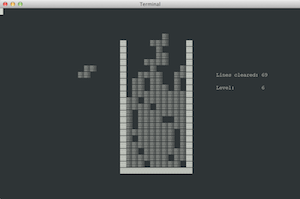

## About

A Clojure based engine for the game of *TETRIS*. 

Simple text-based UI is included as well.

## Objectives

This project is a result of the [Clojure](http://clojure.org/) language teaching process.

## How to run

In order to start the application you'll need to have [Leiningen](http://leiningen.org/) installed.

Run the following command in console:

    lein run

  
## Control keys

- *Up* - rotate counter-clockwise
- *Down* - rotate clockwise
- *Left* - move left
- *Right* - move right
- *Enter* - speed up

## Things to remember

Remember, that playing Tetris

 - Even reasonable 30 minutes per day for three months increases cerebral cortex thickness and 
 improves general cognitive functions defined as "critical thinking, reasoning, language and processing". 
 
 - Could positively influence people trying to diet, quit alcohol abuse or smoking 
 as per research by the Plymouth University's Cognition Institute.  
 
 - Can potentially reduce flashbacks for the people suffering posttraumatic stress disorder.

As identified in the "[Effect of Tetris on the brain](http://en.wikipedia.org/wiki/Tetris#Effect_of_Tetris_on_the_brain)" by Wikipedia.

 
## License

Copyright (c) 2015 Obsidian Innovations, Ltd

Licensed under the Apache License, Version 2.0 (the "License");
you may not use this file except in compliance with the License.
You may obtain a copy of the License at

[http://www.apache.org/licenses/LICENSE-2.0](http://www.apache.org/licenses/LICENSE-2.0)

Unless required by applicable law or agreed to in writing, software
distributed under the License is distributed on an "AS IS" BASIS,
WITHOUT WARRANTIES OR CONDITIONS OF ANY KIND, either express or implied.
See the License for the specific language governing permissions and
limitations under the License.
